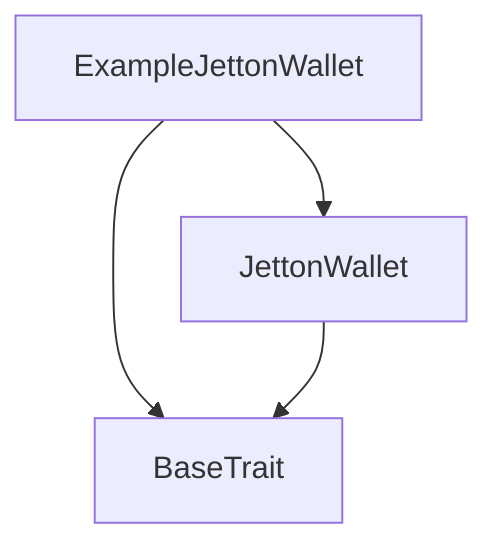
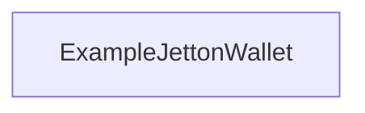

# TACT Compilation Report
Contract: ExampleJettonWallet
BOC Size: 2433 bytes

# Types
Total Types: 19

## StateInit
TLB: `_ code:^cell data:^cell = StateInit`
Signature: `StateInit{code:^cell,data:^cell}`

## StdAddress
TLB: `_ workchain:int8 address:uint256 = StdAddress`
Signature: `StdAddress{workchain:int8,address:uint256}`

## VarAddress
TLB: `_ workchain:int32 address:^slice = VarAddress`
Signature: `VarAddress{workchain:int32,address:^slice}`

## Context
TLB: `_ bounced:bool sender:address value:int257 raw:^slice = Context`
Signature: `Context{bounced:bool,sender:address,value:int257,raw:^slice}`

## SendParameters
TLB: `_ bounce:bool to:address value:int257 mode:int257 body:Maybe ^cell code:Maybe ^cell data:Maybe ^cell = SendParameters`
Signature: `SendParameters{bounce:bool,to:address,value:int257,mode:int257,body:Maybe ^cell,code:Maybe ^cell,data:Maybe ^cell}`

## Deploy
TLB: `deploy#946a98b6 queryId:uint64 = Deploy`
Signature: `Deploy{queryId:uint64}`

## DeployOk
TLB: `deploy_ok#aff90f57 queryId:uint64 = DeployOk`
Signature: `DeployOk{queryId:uint64}`

## FactoryDeploy
TLB: `factory_deploy#6d0ff13b queryId:uint64 cashback:address = FactoryDeploy`
Signature: `FactoryDeploy{queryId:uint64,cashback:address}`

## JettonData
TLB: `_ total_supply:coins mintable:bool admin_address:address jetton_content:^cell jetton_wallet_code:^cell = JettonData`
Signature: `JettonData{total_supply:coins,mintable:bool,admin_address:address,jetton_content:^cell,jetton_wallet_code:^cell}`

## JettonMint
TLB: `jetton_mint#1e6f9c2d origin:address receiver:address amount:int257 custom_payload:Maybe ^cell forward_ton_amount:coins forward_payload:Maybe ^cell = JettonMint`
Signature: `JettonMint{origin:address,receiver:address,amount:int257,custom_payload:Maybe ^cell,forward_ton_amount:coins,forward_payload:Maybe ^cell}`

## JettonTransfer
TLB: `jetton_transfer#0f8a7ea5 query_id:uint64 amount:coins destination:address response_destination:address custom_payload:Maybe ^cell forward_ton_amount:coins forward_payload:Maybe ^cell = JettonTransfer`
Signature: `JettonTransfer{query_id:uint64,amount:coins,destination:address,response_destination:address,custom_payload:Maybe ^cell,forward_ton_amount:coins,forward_payload:Maybe ^cell}`

## JettonTransferNotification
TLB: `jetton_transfer_notification#7362d09c query_id:uint64 amount:coins sender:address forward_payload:Maybe ^cell = JettonTransferNotification`
Signature: `JettonTransferNotification{query_id:uint64,amount:coins,sender:address,forward_payload:Maybe ^cell}`

## JettonBurn
TLB: `jetton_burn#595f07bc query_id:uint64 amount:coins response_destination:address custom_payload:Maybe ^cell = JettonBurn`
Signature: `JettonBurn{query_id:uint64,amount:coins,response_destination:address,custom_payload:Maybe ^cell}`

## JettonExcesses
TLB: `jetton_excesses#d53276db query_id:uint64 = JettonExcesses`
Signature: `JettonExcesses{query_id:uint64}`

## JettonInternalTransfer
TLB: `jetton_internal_transfer#178d4519 query_id:uint64 amount:coins from:address response_address:address forward_ton_amount:coins forward_payload:Maybe ^cell = JettonInternalTransfer`
Signature: `JettonInternalTransfer{query_id:uint64,amount:coins,from:address,response_address:address,forward_ton_amount:coins,forward_payload:Maybe ^cell}`

## JettonBurnNotification
TLB: `jetton_burn_notification#7bdd97de query_id:uint64 amount:coins sender:address response_destination:address = JettonBurnNotification`
Signature: `JettonBurnNotification{query_id:uint64,amount:coins,sender:address,response_destination:address}`

## WalletData
TLB: `_ balance:coins owner:address jetton:address jetton_wallet_code:^cell = WalletData`
Signature: `WalletData{balance:coins,owner:address,jetton:address,jetton_wallet_code:^cell}`

## ExampleJettonWallet$Data
TLB: `null`
Signature: `null`

## ExampleJettonMaster$Data
TLB: `null`
Signature: `null`

# Get Methods
Total Get Methods: 1

## get_wallet_data

# Error Codes
2: Stack underflow
3: Stack overflow
4: Integer overflow
5: Integer out of expected range
6: Invalid opcode
7: Type check error
8: Cell overflow
9: Cell underflow
10: Dictionary error
11: 'Unknown' error
12: Fatal error
13: Out of gas error
14: Virtualization error
32: Action list is invalid
33: Action list is too long
34: Action is invalid or not supported
35: Invalid source address in outbound message
36: Invalid destination address in outbound message
37: Not enough TON
38: Not enough extra-currencies
39: Outbound message does not fit into a cell after rewriting
40: Cannot process a message
41: Library reference is null
42: Library change action error
43: Exceeded maximum number of cells in the library or the maximum depth of the Merkle tree
50: Account state size exceeded limits
128: Null reference exception
129: Invalid serialization prefix
130: Invalid incoming message
131: Constraints error
132: Access denied
133: Contract stopped
134: Invalid argument
135: Code of a contract was not found
136: Invalid address
137: Masterchain support is not enabled for this contract
2296: JettonWallet: Only Jetton master or Jetton wallet can call this function
9739: Sender is not a Jetton wallet
13105: JettonWallet: Not enough jettons to transfer
27831: Only owner can call this function
29133: JettonWallet: Not allow negative balance after internal transfer
30061: JettonMaster: Jetton is not mintable
37185: Not enough funds to transfer
43365: JettonMaster: Sender is not a Jetton owner
47048: JettonWallet: Only owner can burn tokens
60354: JettonWallet: Not enough balance to burn tokens

# Trait Inheritance Diagram

# Contract Dependency Diagram

