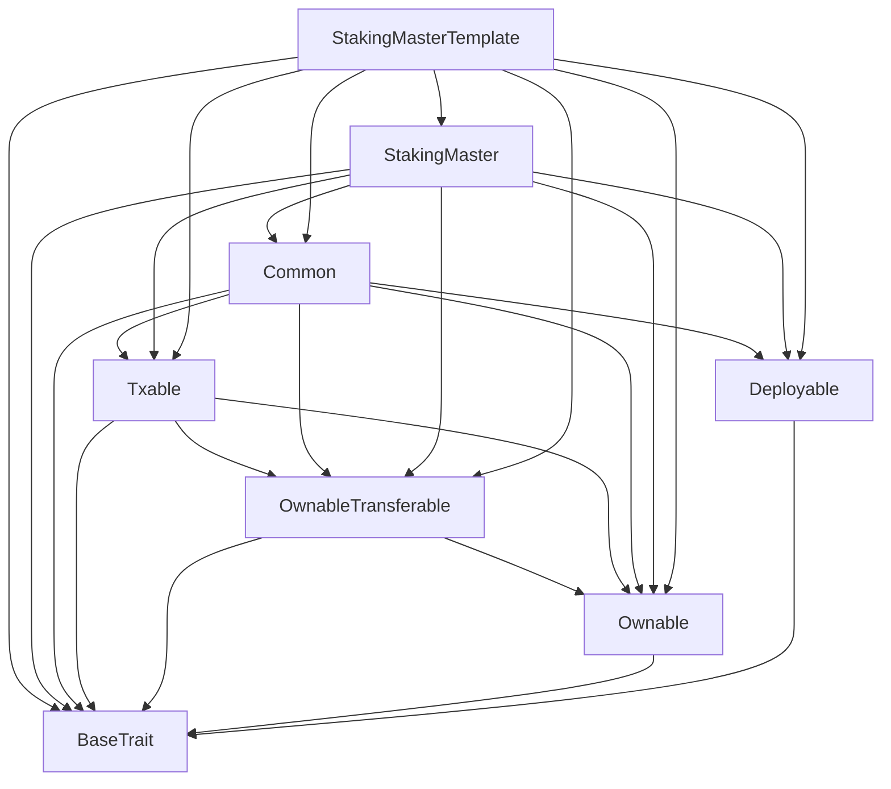
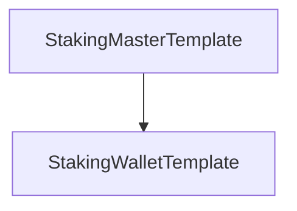

# TACT Compilation Report
Contract: StakingMasterTemplate
BOC Size: 3282 bytes

# Types
Total Types: 52

## StateInit
TLB: `_ code:^cell data:^cell = StateInit`
Signature: `StateInit{code:^cell,data:^cell}`

## StdAddress
TLB: `_ workchain:int8 address:uint256 = StdAddress`
Signature: `StdAddress{workchain:int8,address:uint256}`

## VarAddress
TLB: `_ workchain:int32 address:^slice = VarAddress`
Signature: `VarAddress{workchain:int32,address:^slice}`

## Context
TLB: `_ bounced:bool sender:address value:int257 raw:^slice = Context`
Signature: `Context{bounced:bool,sender:address,value:int257,raw:^slice}`

## SendParameters
TLB: `_ bounce:bool to:address value:int257 mode:int257 body:Maybe ^cell code:Maybe ^cell data:Maybe ^cell = SendParameters`
Signature: `SendParameters{bounce:bool,to:address,value:int257,mode:int257,body:Maybe ^cell,code:Maybe ^cell,data:Maybe ^cell}`

## Deploy
TLB: `deploy#946a98b6 queryId:uint64 = Deploy`
Signature: `Deploy{queryId:uint64}`

## DeployOk
TLB: `deploy_ok#aff90f57 queryId:uint64 = DeployOk`
Signature: `DeployOk{queryId:uint64}`

## FactoryDeploy
TLB: `factory_deploy#6d0ff13b queryId:uint64 cashback:address = FactoryDeploy`
Signature: `FactoryDeploy{queryId:uint64,cashback:address}`

## ChangeOwner
TLB: `change_owner#819dbe99 queryId:uint64 newOwner:address = ChangeOwner`
Signature: `ChangeOwner{queryId:uint64,newOwner:address}`

## ChangeOwnerOk
TLB: `change_owner_ok#327b2b4a queryId:uint64 newOwner:address = ChangeOwnerOk`
Signature: `ChangeOwnerOk{queryId:uint64,newOwner:address}`

## JettonData
TLB: `_ total_supply:coins mintable:bool admin_address:address jetton_content:^cell jetton_wallet_code:^cell = JettonData`
Signature: `JettonData{total_supply:coins,mintable:bool,admin_address:address,jetton_content:^cell,jetton_wallet_code:^cell}`

## JettonMint
TLB: `jetton_mint#1e6f9c2d origin:address receiver:address amount:int257 custom_payload:Maybe ^cell forward_ton_amount:coins forward_payload:Maybe ^cell = JettonMint`
Signature: `JettonMint{origin:address,receiver:address,amount:int257,custom_payload:Maybe ^cell,forward_ton_amount:coins,forward_payload:Maybe ^cell}`

## JettonTransfer
TLB: `jetton_transfer#0f8a7ea5 query_id:uint64 amount:coins destination:address response_destination:address custom_payload:Maybe ^cell forward_ton_amount:coins forward_payload:Maybe ^cell = JettonTransfer`
Signature: `JettonTransfer{query_id:uint64,amount:coins,destination:address,response_destination:address,custom_payload:Maybe ^cell,forward_ton_amount:coins,forward_payload:Maybe ^cell}`

## JettonTransferNotification
TLB: `jetton_transfer_notification#7362d09c query_id:uint64 amount:coins sender:address forward_payload:Maybe ^cell = JettonTransferNotification`
Signature: `JettonTransferNotification{query_id:uint64,amount:coins,sender:address,forward_payload:Maybe ^cell}`

## JettonBurn
TLB: `jetton_burn#595f07bc query_id:uint64 amount:coins response_destination:address custom_payload:Maybe ^cell = JettonBurn`
Signature: `JettonBurn{query_id:uint64,amount:coins,response_destination:address,custom_payload:Maybe ^cell}`

## JettonExcesses
TLB: `jetton_excesses#d53276db query_id:uint64 = JettonExcesses`
Signature: `JettonExcesses{query_id:uint64}`

## JettonInternalTransfer
TLB: `jetton_internal_transfer#178d4519 query_id:uint64 amount:coins from:address response_address:address forward_ton_amount:coins forward_payload:Maybe ^cell = JettonInternalTransfer`
Signature: `JettonInternalTransfer{query_id:uint64,amount:coins,from:address,response_address:address,forward_ton_amount:coins,forward_payload:Maybe ^cell}`

## JettonBurnNotification
TLB: `jetton_burn_notification#7bdd97de query_id:uint64 amount:coins sender:address response_destination:address = JettonBurnNotification`
Signature: `JettonBurnNotification{query_id:uint64,amount:coins,sender:address,response_destination:address}`

## WalletData
TLB: `_ balance:coins owner:address jetton:address jetton_wallet_code:^cell = WalletData`
Signature: `WalletData{balance:coins,owner:address,jetton:address,jetton_wallet_code:^cell}`

## StakeInternal
TLB: `stake_internal#9e1b5d2f queryId:uint64 jettonWallet:address jettonAmount:coins responseDestination:address forwardAmount:coins forwardPayload:Maybe ^cell unstakeThreshold:uint32 = StakeInternal`
Signature: `StakeInternal{queryId:uint64,jettonWallet:address,jettonAmount:coins,responseDestination:address,forwardAmount:coins,forwardPayload:Maybe ^cell,unstakeThreshold:uint32}`

## UnStake
TLB: `un_stake#4d8a3c70 queryId:uint64 jettonAmount:coins jettonWallet:address forwardPayload:Maybe ^cell = UnStake`
Signature: `UnStake{queryId:uint64,jettonAmount:coins,jettonWallet:address,forwardPayload:Maybe ^cell}`

## Withdraw
TLB: `withdraw#6b2f1e9d queryId:uint64 pendingIndex:uint32 tonAmount:coins forwardAmount:coins jettonWallet:address responseDestination:address forwardPayload:Maybe ^cell = Withdraw`
Signature: `Withdraw{queryId:uint64,pendingIndex:uint32,tonAmount:coins,forwardAmount:coins,jettonWallet:address,responseDestination:address,forwardPayload:Maybe ^cell}`

## WithdrawInternal
TLB: `withdraw_internal#c5b9a2d1 queryId:uint64 jettonAmount:coins forwardAmount:coins tonAmount:coins stakeIndex:uint32 jettonWallet:address destination:address responseDestination:address forwardPayload:Maybe ^cell = WithdrawInternal`
Signature: `WithdrawInternal{queryId:uint64,jettonAmount:coins,forwardAmount:coins,tonAmount:coins,stakeIndex:uint32,jettonWallet:address,destination:address,responseDestination:address,forwardPayload:Maybe ^cell}`

## Redeposit
TLB: `redeposit#c5a9b412 queryId:uint64 pendingIndex:uint32 forwardAmount:coins forwardPayload:Maybe ^cell = Redeposit`
Signature: `Redeposit{queryId:uint64,pendingIndex:uint32,forwardAmount:coins,forwardPayload:Maybe ^cell}`

## StakeNotification
TLB: `stake_notification#7f3e2d85 queryId:uint64 jettonAmount:coins jettonWallet:address forwardPayload:Maybe ^cell = StakeNotification`
Signature: `StakeNotification{queryId:uint64,jettonAmount:coins,jettonWallet:address,forwardPayload:Maybe ^cell}`

## StakeReleaseNotification
TLB: `stake_release_notification#e656dfa2 queryId:uint64 amount:coins stakeIndex:uint64 destination:address forwardPayload:Maybe ^cell = StakeReleaseNotification`
Signature: `StakeReleaseNotification{queryId:uint64,amount:coins,stakeIndex:uint64,destination:address,forwardPayload:Maybe ^cell}`

## StakeRelease
TLB: `stake_release#51fa3a81 queryId:uint64 amount:coins jettons:dict<uint64, ^StakeReleaseJettonInfo{tonAmount:coins,jettonAmount:coins,jettonWallet:address,destination:address,customPayload:Maybe ^cell,forwardAmount:coins,forwardPayload:Maybe ^cell}> jettonsIdx:uint64 owner:address destination:address responseDestination:address customPayload:Maybe ^cell forwardAmount:coins forwardPayload:Maybe ^cell = StakeRelease`
Signature: `StakeRelease{queryId:uint64,amount:coins,jettons:dict<uint64, ^StakeReleaseJettonInfo{tonAmount:coins,jettonAmount:coins,jettonWallet:address,destination:address,customPayload:Maybe ^cell,forwardAmount:coins,forwardPayload:Maybe ^cell}>,jettonsIdx:uint64,owner:address,destination:address,responseDestination:address,customPayload:Maybe ^cell,forwardAmount:coins,forwardPayload:Maybe ^cell}`

## TokenTransferForwardPayload
TLB: `_ type:uint8 stakeJetton:Maybe StakeJetton{tonAmount:coins,responseDestination:address,forwardAmount:coins,forwardPayload:Maybe ^cell} stakeRelease:Maybe StakeReleaseNotification{queryId:uint64,amount:coins,stakeIndex:uint64,destination:address,forwardPayload:Maybe ^cell} = TokenTransferForwardPayload`
Signature: `TokenTransferForwardPayload{type:uint8,stakeJetton:Maybe StakeJetton{tonAmount:coins,responseDestination:address,forwardAmount:coins,forwardPayload:Maybe ^cell},stakeRelease:Maybe StakeReleaseNotification{queryId:uint64,amount:coins,stakeIndex:uint64,destination:address,forwardPayload:Maybe ^cell}}`

## StakeJetton
TLB: `_ tonAmount:coins responseDestination:address forwardAmount:coins forwardPayload:Maybe ^cell = StakeJetton`
Signature: `StakeJetton{tonAmount:coins,responseDestination:address,forwardAmount:coins,forwardPayload:Maybe ^cell}`

## StakeReleaseJettonInfo
TLB: `_ tonAmount:coins jettonAmount:coins jettonWallet:address destination:address customPayload:Maybe ^cell forwardAmount:coins forwardPayload:Maybe ^cell = StakeReleaseJettonInfo`
Signature: `StakeReleaseJettonInfo{tonAmount:coins,jettonAmount:coins,jettonWallet:address,destination:address,customPayload:Maybe ^cell,forwardAmount:coins,forwardPayload:Maybe ^cell}`

## JettonWithdrawInfo
TLB: `_ tonAmount:coins jettonAmount:coins jettonWallet:address destination:address customPayload:Maybe ^cell forwardAmount:coins forwardPayload:Maybe ^cell = JettonWithdrawInfo`
Signature: `JettonWithdrawInfo{tonAmount:coins,jettonAmount:coins,jettonWallet:address,destination:address,customPayload:Maybe ^cell,forwardAmount:coins,forwardPayload:Maybe ^cell}`

## StakedJettonInfo
TLB: `_ jettonAmount:coins stakeIndex:uint32 stakeTime:uint32 unstakeThreshold:uint32 = StakedJettonInfo`
Signature: `StakedJettonInfo{jettonAmount:coins,stakeIndex:uint32,stakeTime:uint32,unstakeThreshold:uint32}`

## PendingJettonInfo
TLB: `_ jettonAmount:coins stakeTime:uint32 pendingIndex:uint32 unstakeTime:uint32 unstakeThreshold:uint32 = PendingJettonInfo`
Signature: `PendingJettonInfo{jettonAmount:coins,stakeTime:uint32,pendingIndex:uint32,unstakeTime:uint32,unstakeThreshold:uint32}`

## StakedToPending
TLB: `_ jettonAmount:coins pendingIndex:uint32 = StakedToPending`
Signature: `StakedToPending{jettonAmount:coins,pendingIndex:uint32}`

## PendingToStaked
TLB: `_ jettonAmount:coins pendingIndex:uint32 = PendingToStaked`
Signature: `PendingToStaked{jettonAmount:coins,pendingIndex:uint32}`

## StakedInfo
TLB: `_ stakedJettons:dict<int, ^StakedJettonInfo{jettonAmount:coins,stakeIndex:uint32,stakeTime:uint32,unstakeThreshold:uint32}> pendingJettons:dict<int, ^PendingJettonInfo{jettonAmount:coins,stakeTime:uint32,pendingIndex:uint32,unstakeTime:uint32,unstakeThreshold:uint32}> withdrawalJettons:dict<int, ^WithdrawalJettonInfo{jettonAmount:coins,withdrawTime:uint32}> = StakedInfo`
Signature: `StakedInfo{stakedJettons:dict<int, ^StakedJettonInfo{jettonAmount:coins,stakeIndex:uint32,stakeTime:uint32,unstakeThreshold:uint32}>,pendingJettons:dict<int, ^PendingJettonInfo{jettonAmount:coins,stakeTime:uint32,pendingIndex:uint32,unstakeTime:uint32,unstakeThreshold:uint32}>,withdrawalJettons:dict<int, ^WithdrawalJettonInfo{jettonAmount:coins,withdrawTime:uint32}>}`

## WithdrawalJettonInfo
TLB: `_ jettonAmount:coins withdrawTime:uint32 = WithdrawalJettonInfo`
Signature: `WithdrawalJettonInfo{jettonAmount:coins,withdrawTime:uint32}`

## StakingData
TLB: `_ index:uint64 walletOwner:address masterAddress:address = StakingData`
Signature: `StakingData{index:uint64,walletOwner:address,masterAddress:address}`

## StakeRecord
TLB: `_ stakeAddress:address jettonStakeAmount:coins stakeTime:uint32 = StakeRecord`
Signature: `StakeRecord{stakeAddress:address,jettonStakeAmount:coins,stakeTime:uint32}`

## TransferEvent
TLB: `transfer_event#16967d2d senderAddress:address jettonAmount:coins = TransferEvent`
Signature: `TransferEvent{senderAddress:address,jettonAmount:coins}`

## UnStakeEvent
TLB: `un_stake_event#f2d5977e receiverAddress:address jettonAmount:coins indexId:uint32 = UnStakeEvent`
Signature: `UnStakeEvent{receiverAddress:address,jettonAmount:coins,indexId:uint32}`

## UnStakeAllEvent
TLB: `un_stake_all_event#fef05abf receiverAddress:address jettonAmount:coins = UnStakeAllEvent`
Signature: `UnStakeAllEvent{receiverAddress:address,jettonAmount:coins}`

## AddingJettonAddress
TLB: `adding_jetton_address#e30b692b thisContractJettonWallet:address = AddingJettonAddress`
Signature: `AddingJettonAddress{thisContractJettonWallet:address}`

## Unstake
TLB: `unstake#c6d61784 indexId:uint32 = Unstake`
Signature: `Unstake{indexId:uint32}`

## Redeem
TLB: `redeem#bbefa336 queryId:uint64 projectId:uint16 = Redeem`
Signature: `Redeem{queryId:uint64,projectId:uint16}`

## StakedNotification
TLB: `staked_notification#1eb806a6 from:address masterAddress:address amount:coins = StakedNotification`
Signature: `StakedNotification{from:address,masterAddress:address,amount:coins}`

## UnStakedNotification
TLB: `un_staked_notification#b22375f4 from:address masterAddress:address amount:coins = UnStakedNotification`
Signature: `UnStakedNotification{from:address,masterAddress:address,amount:coins}`

## SetUnstakeThreshold
TLB: `set_unstake_threshold#921ec03e queryId:uint64 threshold:uint32 = SetUnstakeThreshold`
Signature: `SetUnstakeThreshold{queryId:uint64,threshold:uint32}`

## SetStaticTaxFee
TLB: `set_static_tax_fee#1509a420 staticTaxFee:coins = SetStaticTaxFee`
Signature: `SetStaticTaxFee{staticTaxFee:coins}`

## UpgradeContract
TLB: `upgrade_contract#112a9509 queryId:int257 code:Maybe ^cell data:Maybe ^cell responseDestination:address = UpgradeContract`
Signature: `UpgradeContract{queryId:int257,code:Maybe ^cell,data:Maybe ^cell,responseDestination:address}`

## StakingWalletTemplate$Data
TLB: `null`
Signature: `null`

## StakingMasterTemplate$Data
TLB: `null`
Signature: `null`

# Get Methods
Total Get Methods: 5

## userWalletAddress
Argument: owner

## userWallet
Argument: owner

## unstakeThreshold

## staticTaxFee

## owner

# Error Codes
2: Stack underflow
3: Stack overflow
4: Integer overflow
5: Integer out of expected range
6: Invalid opcode
7: Type check error
8: Cell overflow
9: Cell underflow
10: Dictionary error
11: 'Unknown' error
12: Fatal error
13: Out of gas error
14: Virtualization error
32: Action list is invalid
33: Action list is too long
34: Action is invalid or not supported
35: Invalid source address in outbound message
36: Invalid destination address in outbound message
37: Not enough TON
38: Not enough extra-currencies
39: Outbound message does not fit into a cell after rewriting
40: Cannot process a message
41: Library reference is null
42: Library change action error
43: Exceeded maximum number of cells in the library or the maximum depth of the Merkle tree
50: Account state size exceeded limits
128: Null reference exception
129: Invalid serialization prefix
130: Invalid incoming message
131: Constraints error
132: Access denied
133: Contract stopped
134: Invalid argument
135: Code of a contract was not found
136: Invalid address
137: Masterchain support is not enabled for this contract
2296: JettonWallet: Only Jetton master or Jetton wallet can call this function
9739: Sender is not a Jetton wallet
13105: JettonWallet: Not enough jettons to transfer
27831: Only owner can call this function
29133: JettonWallet: Not allow negative balance after internal transfer
30061: JettonMaster: Jetton is not mintable
37185: Not enough funds to transfer
43365: JettonMaster: Sender is not a Jetton owner
47048: JettonWallet: Only owner can burn tokens
60354: JettonWallet: Not enough balance to burn tokens

# Trait Inheritance Diagram

# Contract Dependency Diagram

